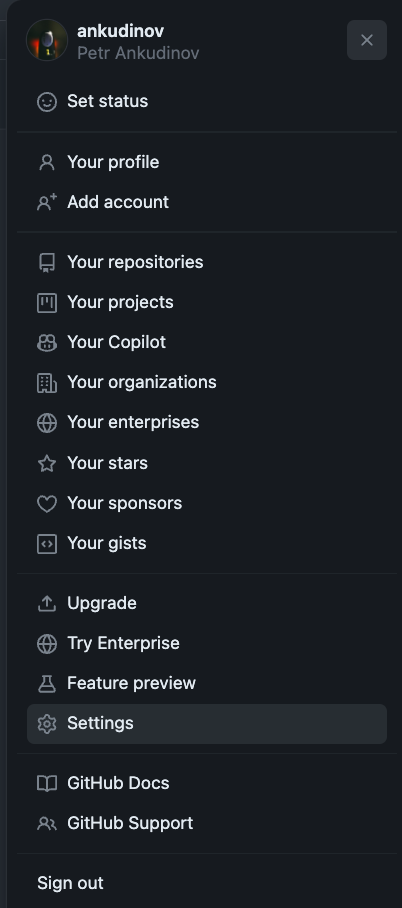

# How to Use One-Click Demos

## Motivation

Every good demo should only take one click to start!  
The purpose of this repository is to provide a collection of demos and labs for Arista SEs and customers, that can be started in Github Codespaces by pressing a single button.

!!! Warning "WARNING!"

    - This repository is still under construction!
    - Please make sure you are using the correct Codespaces size when running the demo!

## Codespaces Machine Types

By default Github provides Codespaces with up to 4 CPUs and 16 GB RAM. That's enough to run some demos and labs in this repository, but not all of them.  
As of time of writing [Github provides 120-core/hours of Codespaces for free each month](https://github.com/features/codespaces). That is approximately 30 hours a month with 4 CPUs.  
If you need bigger machines, please contact [Github support](https://support.github.com/) to enable them. Keep in mind though, that Github may ask for a payment option to enable them and free time will run out faster with bigger instances.  
Github spending limit is always zero by default. That means you remain in full control of your expenses, unless you change the spending limit.

!!! Warning "WARNING!"

    Do NOT enable pre-builds! This may lead to excessive use of Codespaces storage across different regions and increased costs / reduced free time. We don't need Codespaces pre-builds for any demo and to speed up the container start we simply rely on Github packages that are free for public repositories.

## Set Required Tokens Before You Start

Tokens can be generated by registered Arista customers and employees under arista.com profile settings. However any user registred on arista.com can download cEOS-lab image and upload it to the Codespace manually by right clicking VSCode `Explorer` tab and selecting `Upload`.  
Once the image is uploaded, it has to be imported into Docker with the name and the tag specified in the Containerlab definition for the specific demo environment.

Example:

```bash
docker import cEOS-lab-4.30.6M.tar.xz arista/ceos:4.30.6M
```

It's not as convenient as using tokens, but is a small price to pay to start and amazing lab! 😄

!!! Danger "Danger"

    ==**Do NOT set your tokens under the repository settings!**== :skull_and_crossbones:{ .heartbeat }  
    The repository tokens will be visible to all contributors and someone may occasionally use your token to get restricted access. Only set tokens under you account, keep the token lifetime short enough and refresh them periodically.

To set the token:

??? "Step1: Go to the Account Settings (right top corner)"

    { .opacity09 }

???+ "Step2: Go to `Codespaces > Codespaces secrets > New secret`"

    - add ARTOKEN to auto-download EOS images from [arista.com](arista.com). Under `Repository access` select `{{gh.repository}}`
    - add CV_API_TOKEN if CVaaS is part of the demo. Keep in mind, this token has to be created under service account. Device onboarding token is not required as it will be generated automatically. Under `Repository access` select `{{gh.repository}}`

    { .opacity09 }

    !!! Warning "WARNING!"

        Do NOT forget to set `Repository access` for your secrets, otherwise they will be inactive. Some containers may provide a hint before you start them if required secrets are not configured correctly.

## Start and Stop The Demo / Lab

Please access the corresponding documentation section to start the demo and access the related guides.

!!! Info

    Codespaces have 30 minutes idle timeout by default. If required, this timeout can be changed under your Github account > `Settings` > `Codespaces` > `Default idle timeout`. You can also change the `Default retention period` there if required. To avoid stortage charges when Codespace is not running, it's feasible to reduce the `Default retention period` to 1 day.

!!! Tip

    Please do NOT forget to delete the Codespaces you started when you don't need them any more. You can find the full list of Codespaces here: [github.com/codespaces](https://github.com/codespaces)
