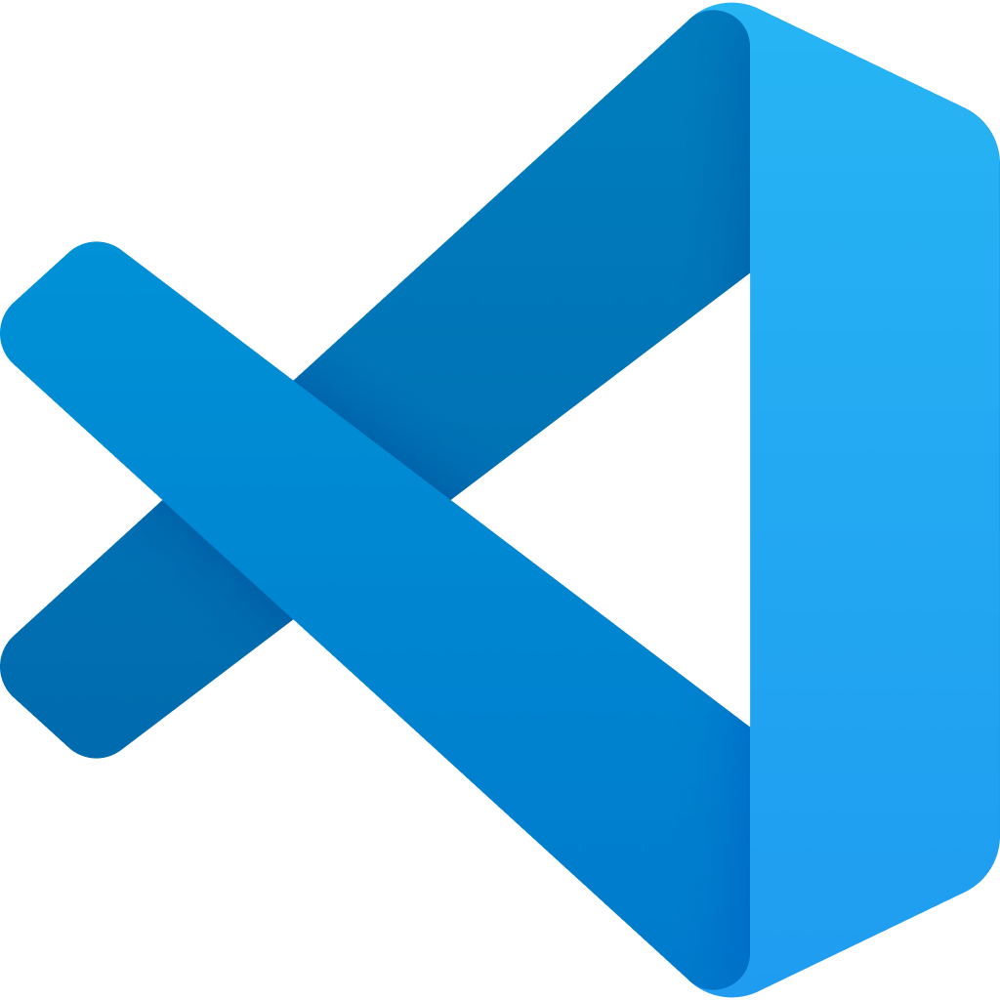
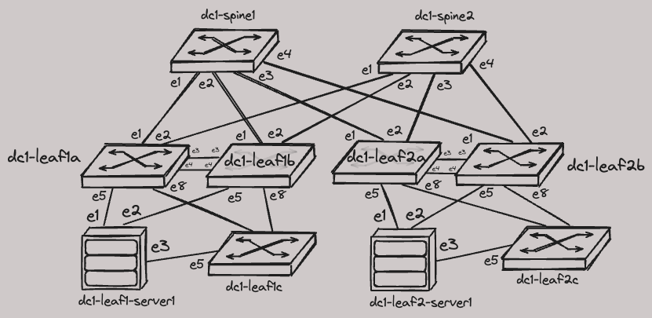

# AVD Extended Workshop

<!-- Do not add page number on this slide -->
<!--
_paginate: false
-->

`Intro into Ansible, Ansible AVD, Git and VSCode for new and existing AVD users`

---

# What is this Workshop about?

<!-- Add footer starting from this slide -->
<!--
footer: 'Arista Ansible AVD Extended Workshop, 2023'
-->

- This workshop is split into 3 sections. Each section takes around 2 hours to complete. That can be done as a full day workshop or split into 3 separate sessions.
- Topics:

  > - Section 1 - Intro:
  >   - Introducing the Tools
  >   - Before We Start - get lab environment up and running
  >   - Prepare Github Codespaces Environment
  >   - Run AVD Playbooks
  >   - Make Some Changes in AVD Repository
  > - Section 2 - Ansible and Git 101
  > - Section 3 - Common AVD provisioning cases

- Make a break when you see a slide with a coffee cup ☕️
- Ask questions at any time!

---

# What is NOT covered in this Workshop?

- This workshop is not a deep dive into each and every topic. It is covering some advanced concepts, but you may need additional documentation and training to understand every topic in details.  
  For additional information please refer to the following resources:
  - [Ansible AVD Documentation](https://avd.arista.com/)
  - [VSCode Documentation](https://code.visualstudio.com/docs)
  - [Git Documentation](https://git-scm.com/doc) - Pro Git book is a good start
  - Container Trainings by [@jpetazzo](https://github.com/jpetazzo):
    - [Github repository](https://github.com/jpetazzo/container.training)
    - [Training materials](https://container.training/)
- We are not going to use Arista CloudVision Portal (CVP) in this workshop. It provides a lot of advantages, but is not essential to understand the concepts covered.
- If you will not find something you expect in this workshop, there can be 2 reasons:
  - There are no plans to cover it
  - It is waiting for your contribution to this repository! 🤝

---

# Requirements

- You **MUST** have a Github account❗
  Register [here](https://github.com/join).
- You **MUST** have an [arista.com account](https://www.arista.com/en/login) to download cEOS-lab image for Codespaces.

---

# Introducing The Tools

`Section 1.1`

> - The bird view on the tools we are going to use in this workshop.
> - No details, they will come in a later sections. Just and overview.

---

# What is Git?

- **In Short**:
  > Git is a distributed version control system that tracks changes to a set of files and enables collaborative work.
- **Fun Fact**:
  > [Git was created](https://git-scm.com/book/en/v2/Getting-Started-A-Short-History-of-Git) by Linus Torvalds in 2005 to develop Linux kernel.

---

# What is GitHub?

- GitHub is a Git repository hosting platform.
- Allows to coordinate multiple local copies of the same repository and more.

---

# VSCode

- Visual Studio Code is an extensible source-code editor developed by Microsoft and free to use.
- This will be our main tool to work with Ansible AVD and interact with Git repositories in the workshop and production.
- We are not going to cover VSCode installation and customization in this workshop. Check [VSCode documentation](https://code.visualstudio.com/docs) for details.

---

# Before We Start

`Section 1.2`

> - How to get your lab environment up and running

---

# Lab Topology

- The lab topology consists of:

  - 2 spines
  - 4 L3 leafs splitted into 2 MLAG pairs
  - 2 L2 leafs ("iLO switches")

---

# Q&A

- [Ansible AVD](https://avd.arista.com/)
- [This repository](https://github.com/{{gh.repository}})
